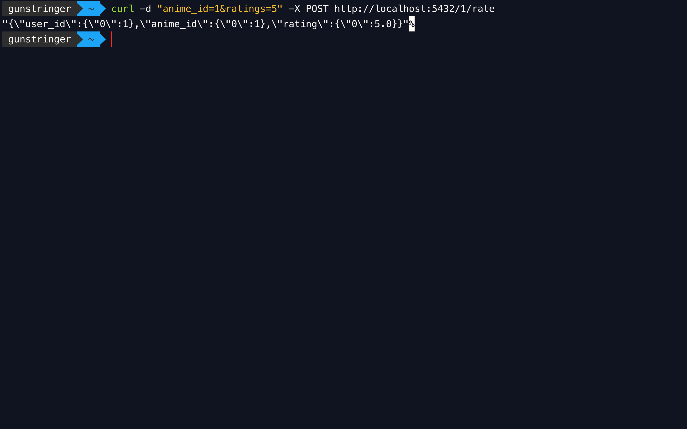
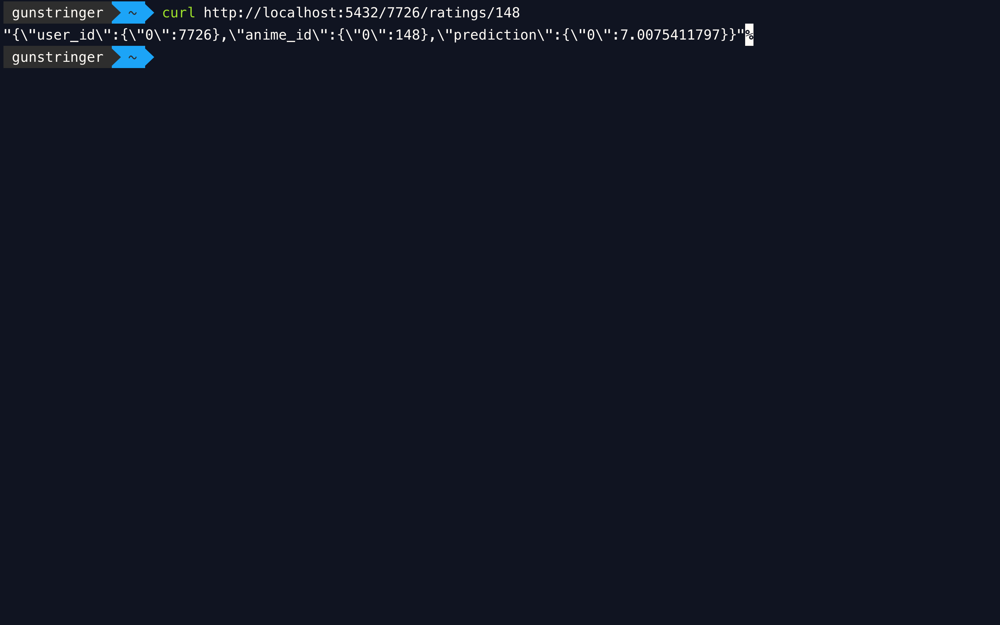
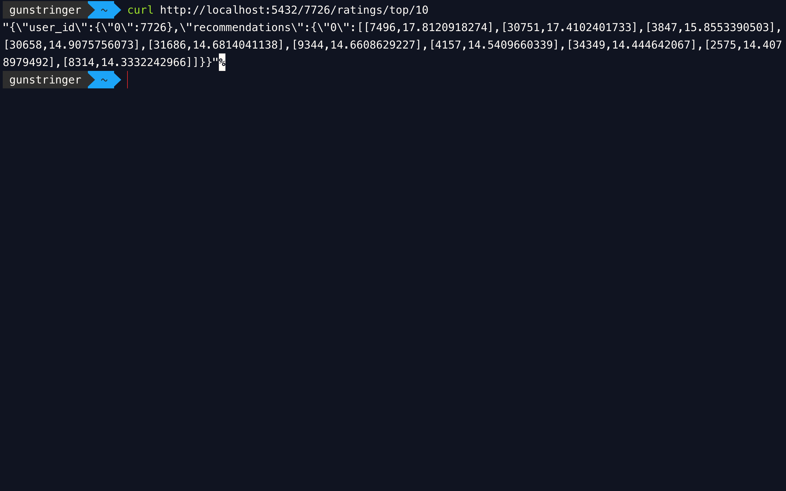
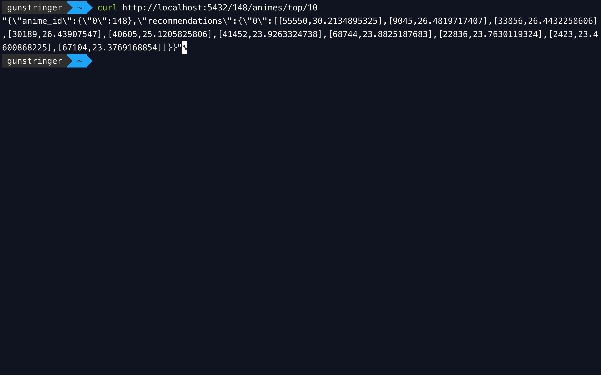

# ANIME RECOMENDER SYSTEM

Sebuah aplikasi REST API yang berguna untuk membuat rekomendasi dari anime. Aplikasi dibangun menggunakan algoritma ALS pyspark yang di serve sebagai API mengguakan flask.

## Aplikasi terdiri dari 3 bagian
- app.py : sebagai api route controller dari flask
- engine.py : sebagai recomender engine yang mengimplementasikan ALS 
- server.py : sebagai start point yang menghubungkan app.py dan engine.py serta menjalankannya diatas cherrypi sebagai web server

## Cara menggunakan : 
- pastikan environtment mengguakan python 3 (export PYSPARK_PYTHON=python3)
- install semua requirements nya (cherrypi, pyspark, pandas)
- jalankan dengan python server.py
- akses pada \<ip_address>:5432/{api}

## Endpoint aplikasi
- /<user_id>/rate **[POST]** \{parameter int(anime_id), int(ratings)}

contoh : 
```
    curl -d "anime_id=1&ratings=5" -X POST http://localhost:5432/1/rate
```


- /<user_id>/ratings/<anime_id> **[GET]**

contoh :
```
    curl http://localhost:5432/7726/ratings/148
```


- /<user_id>/ratings/top/<jumlah> **[GET]**

contoh :
```
    curl http://localhost:5432/7726/ratings/top/10
```


- /<user_id>/animes/top/<jumlah> **[GET]**

contoh :
```
    curl http://localhost:5432/148/animes/top/10
```



### sources:
- https://spark.apache.org/docs/latest/ml-collaborative-filtering.html
- https://spark.apache.org/docs/2.3.0/sql-programming-guide.html
- https://pandas.pydata.org/pandas-docs/stable/reference/api/pandas.DataFrame.to_json.html